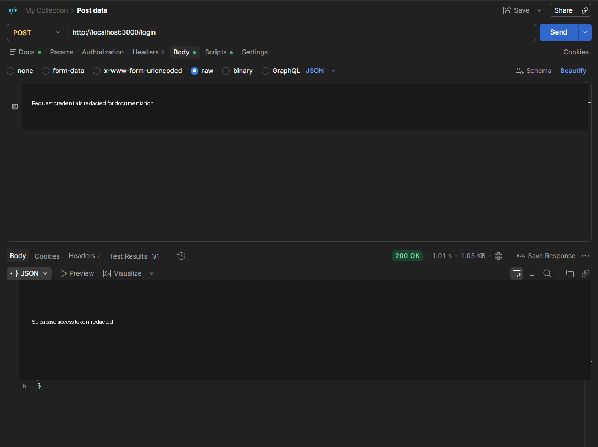

# Bài thực hành số 2: Router, Middleware và xác thực JWT

## 1. Giới thiệu

Dự án xây dựng REST API bằng **Node.js** và **Express** để thực hành định tuyến,
đăng nhập, JWT và middleware xác thực. Người dùng và việc kiểm tra mật khẩu
được quản lý bởi **Supabase Auth**. Khi đăng nhập thành công, Supabase phát hành
JWT access token; API yêu cầu token này cho các route được bảo vệ.

> **Phân biệt nơi chạy:** Supabase được dùng làm dịch vụ xác thực. Express API
> trong dự án này chạy cục bộ trên máy tính tại `http://localhost:3000`; API
> chưa được triển khai thành Supabase Edge Function.

## 2. Mục tiêu và nội dung thực hiện

- Dùng Express để định nghĩa các route REST API.
- Dùng Supabase Auth để đăng nhập bằng email và mật khẩu.
- Trả JWT access token sau khi đăng nhập thành công.
- Tạo middleware đọc Bearer token trong HTTP header và xác minh token với
  Supabase trước khi cho phép truy cập route được bảo vệ.
- Thực hành kiểm tra API bằng Postman.

## 3. Công nghệ sử dụng

- Node.js 20 trở lên
- Express 5
- Supabase Auth và thư viện `@supabase/supabase-js`
- `dotenv` để nạp biến cấu hình từ `.env`
- Node.js test runner để kiểm thử các route

Không cần tạo bảng mật khẩu riêng trong Supabase: Supabase Auth quản lý tài
khoản và thông tin xác thực. Dự án không lưu mật khẩu hay token trong SQLite.

## 4. Cấu trúc dự án

| Tệp | Chức năng |
| --- | --- |
| `server.js` | Khởi động Express server và lắng nghe trên cổng cấu hình |
| `app.js` | Định nghĩa `/login`, `/auth`, `/hello` và xử lý lỗi |
| `auth-middleware.js` | Đọc và xác minh Bearer token với Supabase |
| `supabase.js` | Đọc cấu hình và tạo Supabase client |
| `.env.example` | Mẫu cấu hình môi trường; không chứa key thật |
| `test/auth.test.js` | Kiểm thử đăng nhập và các route cần xác thực |

## 5. Cấu hình Supabase và chạy ứng dụng

### 5.1. Chuẩn bị tài khoản Supabase

Trong Supabase Dashboard, mở project cần dùng:

1. Vào **Project Settings → API Keys** và lấy **publishable key** của project.
2. Vào **Authentication → Users → Add user** để tạo tài khoản bằng email và
   mật khẩu. Dùng đúng project URL tương ứng với project này.
3. Nếu project yêu cầu xác nhận email, xác nhận tài khoản trước khi đăng nhập.

### 5.2. Cài đặt trên Windows PowerShell

Mở PowerShell tại thư mục dự án, ví dụ `C:\Users\admin\SOA`, rồi chạy:

```powershell
npm install
if (-not (Test-Path .env)) { Copy-Item .env.example .env }
notepad .env
```

Điền giá trị của project vào `.env`:

```dotenv
PORT=3000
SUPABASE_URL=https://<project-id>.supabase.co
SUPABASE_PUBLISHABLE_KEY=<publishable-key-cua-project>
```

Lưu file và khởi động API:

```powershell
npm start
```

Khi thấy `Auth API listening on http://localhost:3000`, server đã sẵn sàng.
Giữ cửa sổ PowerShell này mở khi gửi request. Dừng server bằng `Ctrl+C`.

### 5.3. Bảo vệ cấu hình

`.env` chứa cấu hình riêng của máy và được loại khỏi Git bởi `.gitignore`.
Không chép giá trị thật vào README, không công khai secret key hoặc
`service_role` key. API mẫu chỉ cần publishable key. Khi triển khai thực tế,
dùng HTTPS.

## 6. Các API

| Phương thức | Đường dẫn | Xác thực | Chức năng |
| --- | --- | --- | --- |
| `POST` | `/login` | Không | Đăng nhập qua Supabase Auth, trả access token |
| `GET` | `/auth` | Bearer token | Xác minh token và trả thông tin người dùng |
| `GET` | `/hello` | Bearer token | Trả thông điệp `Hello World` |

### 6.1. Đăng nhập

Gửi request:

```http
POST http://localhost:3000/login
Content-Type: application/json
```

Body JSON:

```json
{
  "email": "student@example.com",
  "password": "your-password"
}
```

API cũng chấp nhận tên trường `userName` thay cho `email` để phù hợp với đề
bài. **Giá trị trường này vẫn phải là email Supabase**, không phải username tùy
ý, vì Supabase Auth đang xác thực bằng email.

Phản hồi thành công (`200 OK`):

```json
{
  "token": "<supabase-access-token>",
  "tokenType": "bearer",
  "expiresIn": 3600
}
```

Các phản hồi thường gặp:

| Mã HTTP | Ý nghĩa |
| --- | --- |
| `400` | Thiếu email/`userName` hoặc mật khẩu, hoặc JSON không hợp lệ |
| `401` | Email/mật khẩu sai |
| `429` | Vượt giới hạn số lần đăng nhập |
| `502` | Dịch vụ Supabase không phản hồi hoặc gặp lỗi phía dịch vụ |

### 6.2. Xác thực token và gọi Hello World

Sau khi đăng nhập, gửi access token trong header:

```http
Authorization: Bearer <supabase-access-token>
```

Ví dụ gọi `GET http://localhost:3000/auth` sẽ trả thông tin tài khoản nếu token
hợp lệ:

```json
{
  "authenticated": true,
  "user": {
    "id": "<supabase-user-id>",
    "userName": "student@example.com"
  }
}
```

Gọi `GET http://localhost:3000/hello` với cùng header sẽ trả:

```json
{
  "message": "Hello World"
}
```

Thiếu token, token không hợp lệ hoặc token hết hạn sẽ nhận `401 Unauthorized`.
Middleware xác minh token bằng `supabase.auth.getUser(token)`; không chỉ giải
mã JWT ở phía client để quyết định quyền truy cập.

## 7. Kiểm tra bằng Postman

1. Dùng **Postman Desktop** hoặc **Desktop Agent**. Cloud Agent không truy cập
   được `localhost` trên máy cá nhân.
2. Đăng nhập bằng request `POST http://localhost:3000/login`.
3. Chọn **Body → raw → JSON**, nhập email và mật khẩu đã tạo trong đúng project
   Supabase; đặt `Content-Type: application/json`.
4. Sao chép `token` từ phản hồi thành công.
5. Tạo request `GET` tới `/auth` hoặc `/hello`; chọn **Authorization → Bearer
   Token**, dán token và gửi.

Ảnh minh họa kết quả đăng nhập trong Postman. Email, mật khẩu và access token
đã được che trước khi đưa vào tài liệu:



Tài khoản dùng để minh họa cần được tạo riêng trong Supabase; README không lưu
mật khẩu thật. Nếu thông tin đăng nhập hoặc token từng xuất hiện trong ảnh
chưa che, hãy đổi mật khẩu tài khoản đó và đăng xuất/revoke các phiên đăng nhập
đang hoạt động trong Supabase.

## 8. Luồng xử lý

1. Client gửi email và mật khẩu đến route `/login`.
2. Express gọi Supabase Auth `signInWithPassword`.
3. Supabase kiểm tra thông tin tài khoản và trả session chứa JWT access token.
4. Client gửi token trong header `Authorization` khi gọi route cần bảo vệ.
5. Middleware trích xuất token, gọi Supabase để xác minh, gắn user đã xác thực
   vào request rồi mới chuyển tiếp đến route.

## 9. Kiểm thử

Chạy kiểm thử tự động:

```powershell
npm test
```

Các kiểm thử dùng Supabase Auth giả lập, nên không cần tài khoản mạng hoặc gọi
project Supabase thật. Chúng bao phủ đăng nhập thành công/thất bại, xác minh
token, từ chối request thiếu token và phản hồi của `/hello`.

## 10. Giới hạn của phiên bản thực hành

- Express API chạy cục bộ; muốn cung cấp API qua Internet cần triển khai server
  Express lên dịch vụ hosting hoặc chuyển route sang Supabase Edge Functions.
- Đăng nhập dùng email theo cấu hình Supabase Auth. Trường `userName` chỉ là
  tên thay thế cho trường email trong request, không bật đăng nhập bằng username.
- Base64 chỉ là mã hóa biểu diễn dữ liệu, còn MD5 không phù hợp để bảo vệ mật
  khẩu. API gửi mật khẩu qua JSON; khi triển khai thật phải dùng HTTPS.
